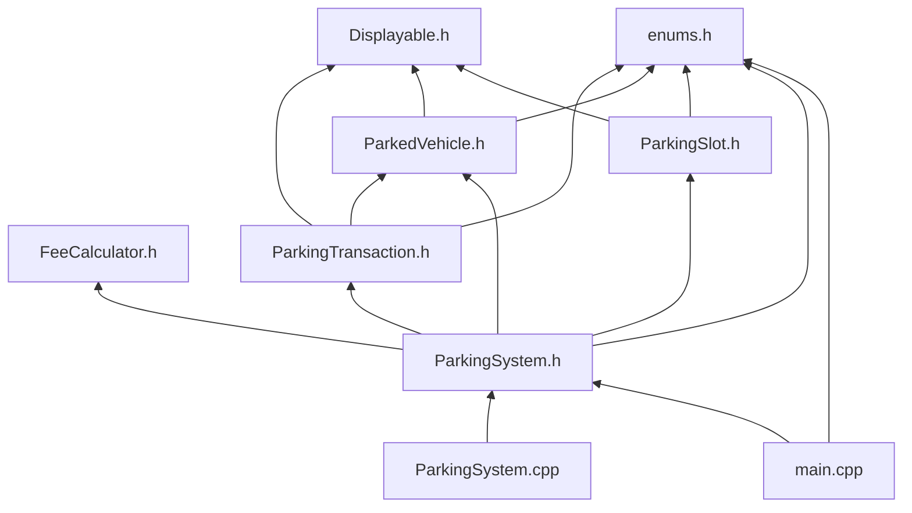

# File Reference

This document explains the purpose, contents, and relationships of **every file** in the Kigali Smart Parking Management System project.

---

## Project Structure

```
TICKET-PARKING-SYSTEM/
├── main.cpp                 # Entry point and console UI
├── ParkingSystem.h          # Core system interface
├── ParkingSystem.cpp        # Core system implementation
├── ParkingSlot.h            # Parking slot model
├── ParkedVehicle.h          # Active parked vehicle model
├── ParkingTransaction.h     # Completed transaction record
├── FeeCalculator.h          # Fee calculation strategy (polymorphism)
├── Displayable.h            # Abstract display interface
├── enums.h                  # Shared enumerations and helpers
├── README.md                # Compile/run guide and quick reference
├── test_input.txt           # Manual test scenarios
├── parking_system.exe       # Compiled executable (after build)
└── docs/                    # Technical documentation (this folder)
    ├── README.md
    ├── system-flow.md
    ├── file-reference.md
    └── diagrams/
        ├── architecture.mmd
        ├── class-diagram.mmd
        ├── menu-flow.mmd
        ├── vehicle-entry-flow.mmd
        ├── vehicle-exit-flow.mmd
        └── data-structures.mmd
```

---

## Source Code Files

### `main.cpp`

| Attribute | Detail |
|-----------|--------|
| **Role** | Application entry point and presentation layer |
| **Layer** | UI / Console Interface |
| **Compiled** | Yes (linked with `ParkingSystem.cpp`) |

**Responsibilities:**
- Displays the welcome message and main menu in a loop
- Reads and validates user input (integers, strings, vehicle types)
- Routes each menu option to the correct `ParkingSystem` method
- Contains no business logic — only I/O and menu dispatch

**Key functions:**

| Function | Purpose |
|----------|---------|
| `main()` | Creates `ParkingSystem`, runs menu loop |
| `printMenu()` | Renders the 12-option menu |
| `readInt()` / `readLine()` | Safe console input with validation |
| `readVehicleType()` | Parses vehicle type from number or name |
| `handleAddSlot()` | Collects slot data and calls `addSlot()` |
| `handleVehicleEntry()` | Collects plate/type and calls `registerEntry()` |
| `handleVehicleExit()` | Collects plate and calls `registerExit()` |
| `handleUpdateRates()` | Collects type/rate and calls `updateHourlyRate()` |
| `handleDailyRevenue()` | Collects optional date and calls `displayDailyRevenue()` |

**Dependencies:** `ParkingSystem.h`, `enums.h`

---

### `ParkingSystem.h`

| Attribute | Detail |
|-----------|--------|
| **Role** | Public interface for the parking management engine |
| **Layer** | Business Logic |
| **Compiled** | Included by `ParkingSystem.cpp` and `main.cpp` |

**Responsibilities:**
- Declares all in-memory data stores
- Exposes public API for slot management, entry/exit, rates, and reports
- Hides internal helpers (`findAvailableSlot`, `minutesBetween`)

**Data members:**

| Member | Type | Purpose |
|--------|------|---------|
| `slots` | `unordered_map<string, ParkingSlot>` | All configured parking slots |
| `activeVehicles` | `unordered_map<string, ParkedVehicle>` | Currently parked vehicles |
| `transactionHistory` | `vector<ParkingTransaction>` | Completed exit records |
| `hourlyRates` | `unordered_map<VehicleType, int>` | Active tariffs |
| `feeCalculator` | `unique_ptr<FeeCalculator>` | Polymorphic fee engine |

**Dependencies:** `FeeCalculator.h`, `ParkedVehicle.h`, `ParkingSlot.h`, `ParkingTransaction.h`, `enums.h`

---

### `ParkingSystem.cpp`

| Attribute | Detail |
|-----------|--------|
| **Role** | Implementation of all parking business rules |
| **Layer** | Business Logic |
| **Compiled** | Yes |

**Responsibilities:**
- Initializes default rates (500 / 1000 / 2000 RWF)
- Validates all inputs before modifying data
- Coordinates slot allocation, status updates, and record keeping
- Produces all operational reports

**Key methods:**

| Method | Task | Data Structures Used |
|--------|------|----------------------|
| `addSlot()` | Task 1 | `slots` insert O(1) |
| `registerEntry()` | Task 2 | `activeVehicles` + `slots` update |
| `registerExit()` | Tasks 3 & 4 | `activeVehicles` erase, `slots` release, `transactionHistory` append |
| `updateHourlyRate()` | Task 3 | `hourlyRates` update |
| `displayAllSlots()` | Reports | `slots` traversal |
| `displayAvailableSlots()` | Reports | filtered `slots` traversal |
| `displayParkedVehicles()` | Reports | `activeVehicles` traversal |
| `displayTransactionHistory()` | Reports | `transactionHistory` traversal |
| `displayDailyRevenue()` | Reports | filtered `transactionHistory` + sum |
| `loadSampleData()` | Testing | resets and seeds 7 sample slots |

**Dependencies:** `ParkingSystem.h`

---

### `ParkingSlot.h`

| Attribute | Detail |
|-----------|--------|
| **Role** | Model class for a single parking slot |
| **Layer** | Domain Model |
| **Compiled** | Header-only (included by other translation units) |

**Attributes:**
- `slotId` — unique identifier (string)
- `supportedType` — Motorcycle, Car, or Truck
- `zone` — physical location label
- `status` — Available or Occupied

**OOP:** Inherits `Displayable`, implements `display()` for console output.

**Key methods:** `isAvailable()`, `supports()`, `setStatus()`, getters.

**Used by:** `ParkingSystem` (stored in `slots` map)

---

### `ParkedVehicle.h`

| Attribute | Detail |
|-----------|--------|
| **Role** | Model for a vehicle currently inside the parking area |
| **Layer** | Domain Model |
| **Compiled** | Header-only |

**Attributes:**
- `plateNumber` — unique while parked
- `vehicleType` — Motorcycle, Car, or Truck
- `entryTime` — `chrono::system_clock::time_point`
- `allocatedSlotId` — reference to assigned slot

**OOP:** Inherits `Displayable`; provides static `formatTime()` utility used by transactions too.

**Used by:** `ParkingSystem` (stored in `activeVehicles` map), `ParkingTransaction.h`

---

### `ParkingTransaction.h`

| Attribute | Detail |
|-----------|--------|
| **Role** | Immutable-style record of a completed parking session |
| **Layer** | Domain Model |
| **Compiled** | Header-only |

**Attributes:**
- Identity: `plateNumber`, `vehicleType`, `slotId`
- Times: `entryTime`, `exitTime`, `durationMinutes`
- Billing: `billedHours`, `hourlyRateApplied`, `totalFee`

**Why `hourlyRateApplied` exists:** Preserves the rate used at exit so future price changes do not alter historical records.

**Key methods:** `getExitDate()` (for daily revenue filtering), `display()`.

**Used by:** `ParkingSystem` (stored in `transactionHistory` vector)

---

### `FeeCalculator.h`

| Attribute | Detail |
|-----------|--------|
| **Role** | Strategy pattern for parking fee computation |
| **Layer** | Business Logic / Strategy |
| **Compiled** | Header-only |

**Classes:**
- `FeeCalculator` — abstract base with virtual `calculateBilledHours()` and `calculateFee()`
- `StandardFeeCalculator` — concrete implementation using ceiling-hour billing

**OOP:** Demonstrates **polymorphism** — `ParkingSystem` holds a `unique_ptr<FeeCalculator>` and can swap implementations without changing exit logic.

**Billing rule:** `billedHours = ceil(durationMinutes / 60.0)`, minimum 1 hour.

**Used by:** `ParkingSystem` during `registerExit()`

---

### `Displayable.h`

| Attribute | Detail |
|-----------|--------|
| **Role** | Abstract interface for console-reportable entities |
| **Layer** | Abstraction |
| **Compiled** | Header-only |

**OOP:** Pure virtual `display()` method — demonstrates **abstraction**.

**Implementations:** `ParkingSlot`, `ParkedVehicle`, `ParkingTransaction`

**Used by:** All three model classes for consistent report rendering

---

### `enums.h`

| Attribute | Detail |
|-----------|--------|
| **Role** | Shared type definitions and string conversion utilities |
| **Layer** | Shared / Utilities |
| **Compiled** | Header-only |

**Contents:**
- `enum class VehicleType` — Motorcycle, Car, Truck
- `enum class SlotStatus` — Available, Occupied
- `vehicleTypeToString()` — enum to readable text
- `slotStatusToString()` — enum to readable text
- `parseVehicleType()` — parse user input to enum

**Used by:** Nearly all source files for type safety and consistent labels

---

## Supporting Files

### `README.md` (project root)

| Attribute | Detail |
|-----------|--------|
| **Role** | User-facing quick start guide |
| **Audience** | Developers, assessors, operators |

**Contents:**
- Default parking rates table
- Compile and run commands (Windows and Linux/macOS)
- Menu option reference
- Data structure justification summary
- OOP design overview
- Pointer to `test_input.txt`

**Does not contain:** Detailed flow diagrams or per-file technical breakdown (see `docs/` for that).

---

### `test_input.txt`

| Attribute | Detail |
|-----------|--------|
| **Role** | Step-by-step manual test script |
| **Audience** | Tester / assessor |

**Contents:**
- 8 structured test scenarios covering all 4 tasks plus reports and validation
- Expected outcomes for each step
- Quick minimum demo sequence (options 11 → 3 → 7 → 4 → 8 → 5 → 10 → 0)

**Usage:** Run `parking_system.exe`, then follow the steps interactively. Not piped automatically.

---

### `parking_system.exe`

| Attribute | Detail |
|-----------|--------|
| **Role** | Compiled Windows executable |
| **Generated by** | `g++ -std=c++17 -o parking_system.exe main.cpp ParkingSystem.cpp` |

This file is a build artifact. It is not source code and is not required for compilation on other machines.

---

## Documentation Files (`docs/`)

### `docs/README.md`

Index page for the documentation folder. Lists all documents and diagrams with descriptions and rendering instructions.

### `docs/system-flow.md`

Detailed narrative of system behavior with embedded Mermaid diagrams covering:
- Architecture layers
- Startup, menu, entry, exit, billing, and reporting flows
- Error handling
- Task-to-component mapping

### `docs/file-reference.md`

This file. Complete catalog of every project file.

### `docs/diagrams/*.mmd`

Standalone Mermaid source files for each diagram. Can be previewed in editors or exported to PNG/SVG using the Mermaid CLI.

| File | Diagram Type |
|------|--------------|
| `architecture.mmd` | Component / layer diagram |
| `class-diagram.mmd` | UML-style class relationships |
| `menu-flow.mmd` | Menu option routing |
| `vehicle-entry-flow.mmd` | Entry decision flowchart |
| `vehicle-exit-flow.mmd` | Exit decision flowchart |
| `data-structures.mmd` | Data store operations map |

---

## Include Dependency Graph



**Compilation units:** Only `main.cpp` and `ParkingSystem.cpp` are compiled. All other `.h` files are header-only and included transitively.

---

## File Responsibility Matrix

| File | Configure Slots | Entry | Exit/Fees | Reports | UI | OOP Demo |
|------|-----------------|-------|-----------|---------|-----|----------|
| `main.cpp` | routes | routes | routes | routes | yes | — |
| `ParkingSystem.h/cpp` | yes | yes | yes | yes | — | encapsulation |
| `ParkingSlot.h` | model | — | release | display | — | inheritance |
| `ParkedVehicle.h` | — | model | read | display | — | inheritance |
| `ParkingTransaction.h` | — | — | archive | display | — | inheritance |
| `FeeCalculator.h` | — | — | calculate | — | — | polymorphism |
| `Displayable.h` | — | — | — | interface | — | abstraction |
| `enums.h` | types | types | types | labels | parse | — |
| `README.md` | docs | docs | docs | docs | docs | summary |
| `test_input.txt` | test | test | test | test | test | — |
| `docs/*` | docs | docs | docs | docs | docs | diagrams |
