# System Flow Documentation

This document describes how the Kigali Smart Parking Management System works from startup to exit, including how each assessment task maps to the implementation.

---

## 1. High-Level System Flow

The system follows a three-layer architecture:

1. **Presentation Layer** (`main.cpp`) — menu-driven console interface
2. **Business Logic Layer** (`ParkingSystem`) — rules, validation, and orchestration
3. **Data Layer** (in-memory maps and vectors) — slots, active vehicles, rates, and history

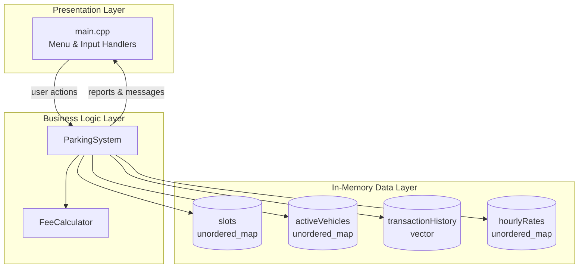

---

## 2. Application Startup Flow

```mermaid
flowchart TD
    A[Program Starts] --> B[Create ParkingSystem object]
    B --> C[Initialize default hourly rates<br/>Motorcycle: 500 | Car: 1000 | Truck: 2000]
    C --> D[Create StandardFeeCalculator]
    D --> E[Initialize empty data stores]
    E --> F[Display welcome message]
    F --> G[Show main menu]
    G --> H{User selects option}
    H -->|0| I[Exit program]
    H -->|1-11| J[Execute selected operation]
    J --> G
```

On startup, no slots or vehicles exist until the operator configures slots manually (option 1) or loads sample data (option 11).

---

## 3. Menu Navigation Flow

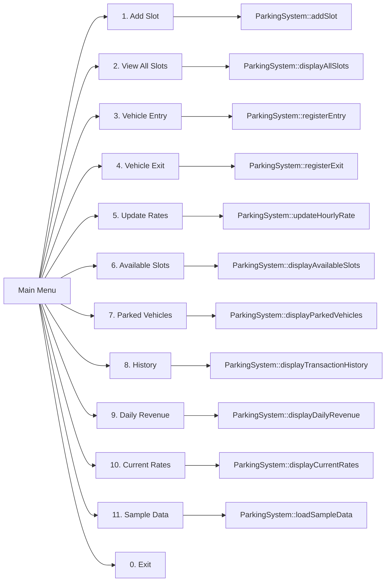

The menu never calls model classes directly. All operations go through `ParkingSystem`, which keeps business rules centralized.

---

## 4. Task 1 — Parking Slot Configuration Flow

**Goal:** Add uniquely identified slots with vehicle type, zone, and status.

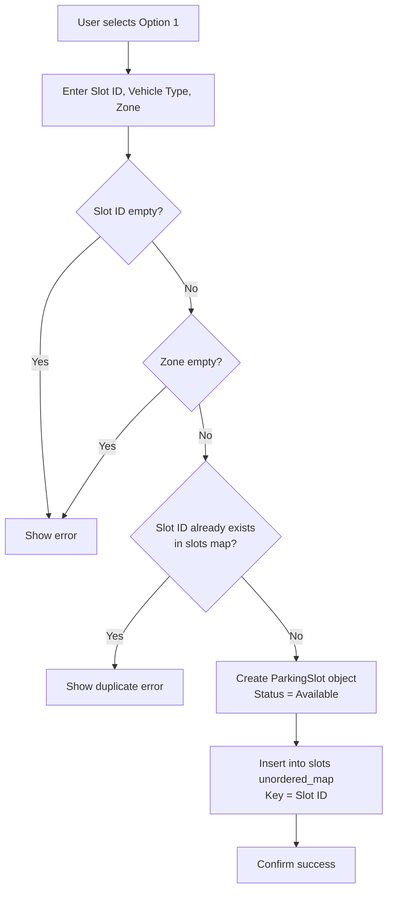

**Data structure:** `unordered_map<string, ParkingSlot> slots`

| Operation | Complexity | How |
|-----------|------------|-----|
| Insert slot | O(1) avg | `slots.emplace(slotId, slot)` |
| Lookup slot | O(1) avg | `slots.find(slotId)` |
| Traverse all | O(n) | iterate map for reports |

---

## 5. Task 2 — Vehicle Entry Flow

**Goal:** Register a vehicle, prevent duplicate parking, and allocate a matching available slot.

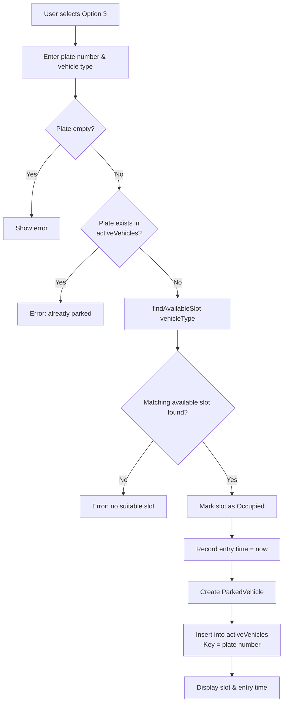

**Slot search logic (`findAvailableSlot`):**

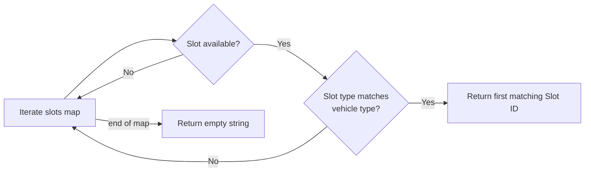

**Data structure:** `unordered_map<string, ParkedVehicle> activeVehicles`

Duplicate detection is O(1) because the plate number is the map key.

---

## 6. Task 3 — Fee Calculation and Rate Update Flow

### 6.1 Fee Calculation (at exit only)

Fees are **never** calculated at entry. They are computed when the vehicle exits.

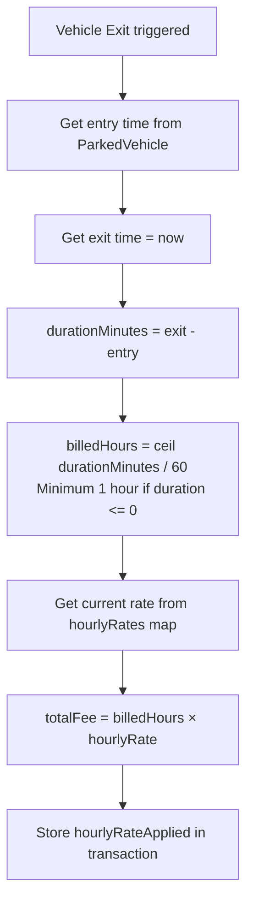

**Billing examples:**

| Actual Duration | Billed Hours | Car Fee (1000 RWF/hr) |
|-----------------|--------------|------------------------|
| 0 min           | 1            | 1,000 RWF              |
| 15 min          | 1            | 1,000 RWF              |
| 60 min          | 1            | 1,000 RWF              |
| 80 min (1h 20m) | 2            | 2,000 RWF              |

### 6.2 Rate Update Flow

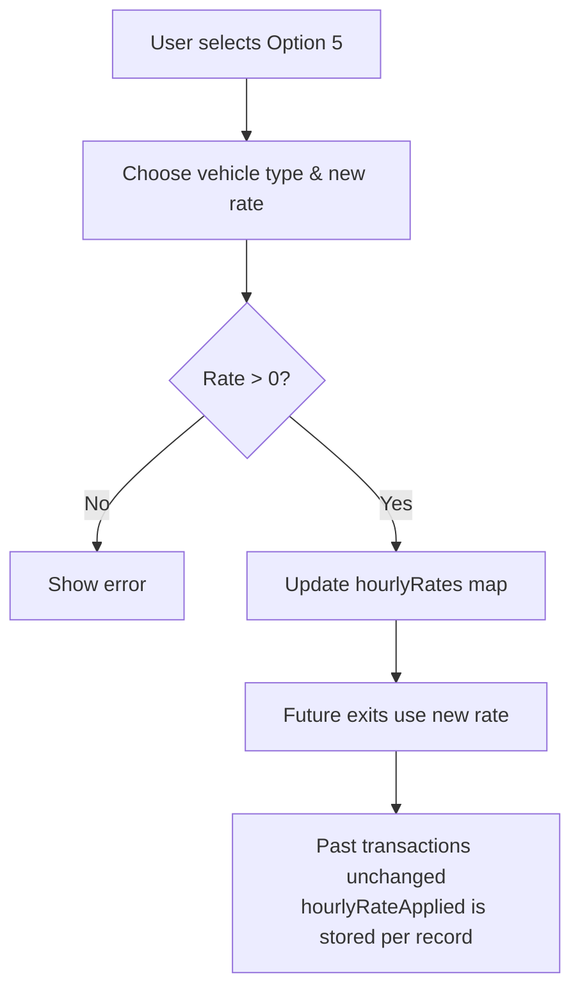

**Why history is unaffected:** Each `ParkingTransaction` stores its own `hourlyRateApplied` and `totalFee` at exit time. Updating `hourlyRates` only affects future exits.

---

## 7. Task 4 — Vehicle Exit Flow

**Goal:** Release slot, calculate fee, update records, and archive the transaction.

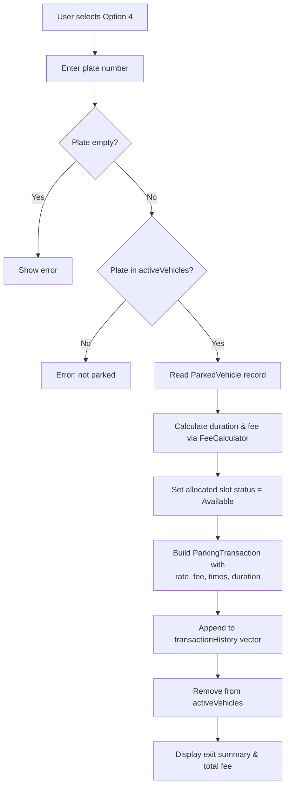

**Record lifecycle:**

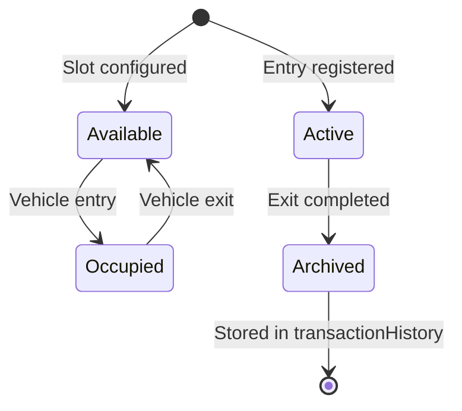

---

## 8. Reporting Flows

### 8.1 Available Slots (Option 6)

Traverse `slots` map → filter where `status == Available` → call `display()` on each.

### 8.2 Parked Vehicles (Option 7)

Traverse `activeVehicles` map → display each `ParkedVehicle`.

### 8.3 Vehicle History (Option 8)

Sequential traversal of `transactionHistory` vector → display each completed `ParkingTransaction`.

### 8.4 Daily Revenue (Option 9)

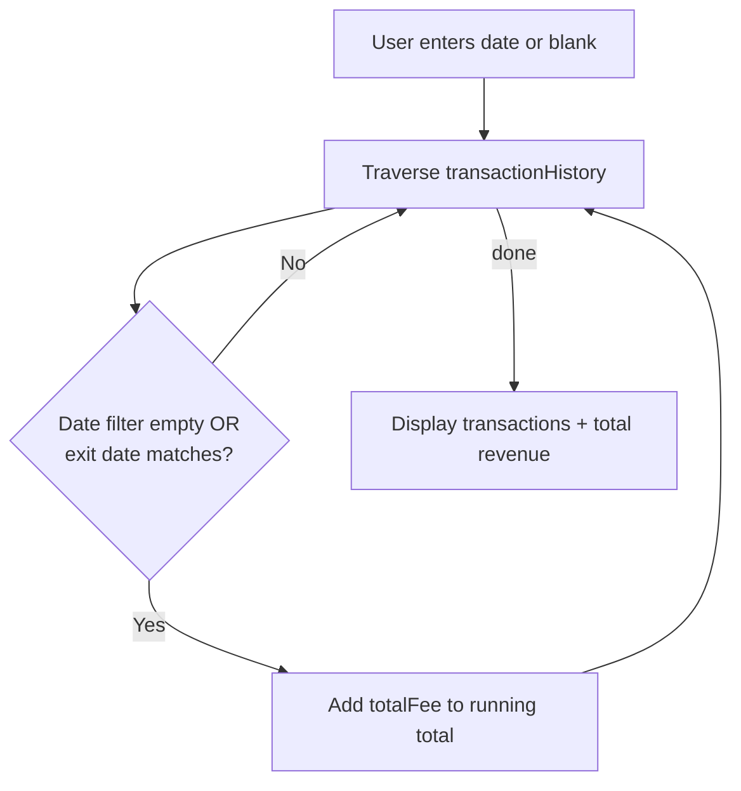

---

## 9. End-to-End Parking Session

A complete parking session from arrival to payment:

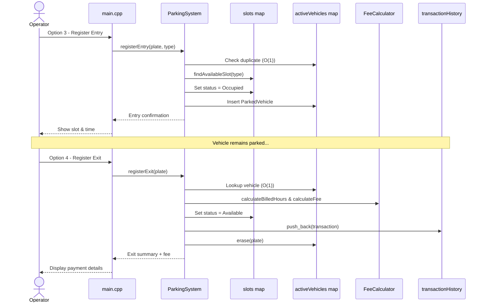

---

## 10. Error Handling Summary

| Scenario | Handling |
|----------|----------|
| Empty slot ID / zone / plate | Validation error, operation cancelled |
| Duplicate slot ID | Rejected before insert |
| Vehicle already parked | Rejected via `activeVehicles` lookup |
| No matching available slot | Graceful message, no state change |
| Exit unknown plate | Error, no records modified |
| Invalid vehicle type input | Re-prompt in `readVehicleType()` |
| Non-numeric menu choice | Re-prompt in `readInt()` |
| Rate update ≤ 0 | Rejected with error message |

---

## 11. Task-to-Component Mapping

| Assessment Task | Primary Files | Key Methods |
|-----------------|---------------|-------------|
| Task 1: Slot Configuration | `ParkingSlot.h`, `ParkingSystem.cpp` | `addSlot()`, `displayAllSlots()` |
| Task 2: Vehicle Entry | `ParkedVehicle.h`, `ParkingSystem.cpp` | `registerEntry()`, `findAvailableSlot()` |
| Task 3: Fee Calculation | `FeeCalculator.h`, `ParkingSystem.cpp` | `registerExit()`, `updateHourlyRate()` |
| Task 4: Vehicle Exit | `ParkingTransaction.h`, `ParkingSystem.cpp` | `registerExit()` |
| Reports | `ParkingSystem.cpp`, `Displayable.h` | `displayAvailableSlots()`, `displayParkedVehicles()`, `displayTransactionHistory()`, `displayDailyRevenue()` |
| User Interface | `main.cpp` | `printMenu()`, handler functions |
| Shared Types | `enums.h` | `VehicleType`, `SlotStatus`, parsers |
